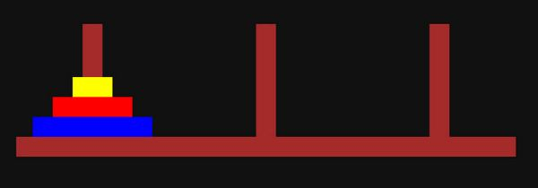

# Les tours de Hanoï

Voici un jeu de réflexion très connu des développeurs !

Plus d'info sur <https://fr.wikipedia.org/wiki/Tours_de_Hano%C3%AF>

Réaliser ce jeu grâce au canvas de Javascript.

Version 1 : proposer au joueur de cliquer sur un disque puis sur une tour pour le déplacer, en interdisant de mettre un disque plus grand sur un disque plus petit.

Version 2 : résolver l'énigme, avec temporisation, comme sur la vidéo : <https://youtu.be/yLt8qCXl2Gk>